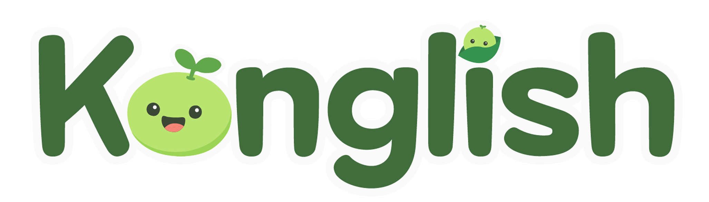

# 🚀 프로젝트 이름



Konglish는 아동기 유저에게 증강현실에서의 즐거운 영어 학습 경험을 제공하는 AR 학습 게임 앱입니다.

[]()
[]()
[]()

---

<br>

## 👥 멤버
| 정의찬 (jeOng) | 권윤진 (Riel) | 길지훈 (Gil) | 임영택 (Bob) | 박신범 (Powel)
|:------:|:------:|:------:|:------:|:------:|
|  |  |  |  |  |
| iOS | Design | iOS | iOS | PM |  
| [제옹의 깃허브](https://github.com/JEONG-J) | [리엘의 깃허브](https://github.com/jini-coding) | [길의 깃허브](https://github.com/giljihun) | [밥의 깃허브](https://github.com/0tak2) | [포웰의 깃허브](https://github.com/powel858) |
<br>


## 📱 소개

## Challenge Statement

Spatial Computing(ARKit, RealityKit, …)기술을 찰떡같이 사용한 앱을 만들자

## Use Case

👤 영단어 암기 + 발음 학습을 재미있게 하고 싶은 사람  
🔨 방을 스캔하고 방 안에 학습을 위한 가상 오브젝트를 배치해줌

## Solution Concept

영어 학습을 시작한지 얼마 되지 않은 아동기(초등학교 저학년 정도) 유저에게, AR을 이용한 증강현실에서의 즐거운 영어 학습 방법을 제공하여, 유저가 흥미를 잃지 않고 재미있게 영어 발음을 학습할 수 있도록 하자

## App Statement

초등학교 저학년 정도의 유저에게 Apple의 AR 기술을 이용해, 증강현실에서의 즐거운 영어 학습 경험을 제공해, 유저가 흥미를 잃지 않고 재미있게 영어 발음을 학습할 수 있게 하는 앱

<br>

## 📆 프로젝트 기간
- 챌린지 기간: `2025.06.25 ~ 2025.07.28`
- 유지 보수: `2025.08 ~`

<br>

## 🤔 요구사항

- Xcode 
- Tuist 4.61.x 이상

<br>

## ⚒️ 개발 환경
* Front : SwiftUI
* 버전 및 이슈 관리 : Github, Github Issues

<br>

## 🔎 기술 스택

### Apple Technologies
|  |  |  |  |
|:------:|:------:|:------:|:------:|
| SwiftUI | ARKit | RealityKit | Speech |

### Envrionment
<div align="left">


</div>

### Development
<div align="left">


</div>

### Communication
<div align="left">


</div>

<br>

## 🔖 브랜치 컨벤션
* `main` - 제품 출시 브랜치
* `develop` - 출시를 위해 개발하는 브랜치
* `feat/xx` - 기능 단위로 독립적인 개발 환경을 위해 작성
* `refac/xx` - 개발된 기능을 리팩토링 하기 위해 작성
* `hotfix/xx` - 출시 버전에서 발생한 버그를 수정하는 브랜치
* `chore/xx` - 빌드 작업, 패키지 매니저 설정 등
* `design/xx` - 디자인 변경
* `bugfix/xx` - 디자인 변경


<br>

## 🌀 코딩 컨벤션
* 파라미터 이름을 기준으로 줄바꿈 한다.
```swift
let actionSheet = UIActionSheet(
  title: "정말 계정을 삭제하실 건가요?",
  delegate: self,
  cancelButtonTitle: "취소",
  destructiveButtonTitle: "삭제해주세요"
)
```

<br>

* if let 구문이 길 경우에 줄바꿈 한다
```swift
if let user = self.veryLongFunctionNameWhichReturnsOptionalUser(),
   let name = user.veryLongFunctionNameWhichReturnsOptionalName(),
  user.gender == .female {
  // ...
}
```

* 나중에 추가로 작업해야 할 부분에 대해서는 `// TODO: - xxx 주석을 남기도록 한다.`
* 코드의 섹션을 분리할 때는 `// MARK: - xxx 주석을 남기도록 한다.`
* 함수에 대해 전부 주석을 남기도록 하여 무슨 액션을 하는지 알 수 있도록 한다.

<br>

## 📁 PR 컨벤션
* PR 시, 템플릿이 등장한다. 해당 템플릿에서 작성해야할 부분은 아래와 같다
    1. `PR 유형 작성`, 어떤 변경 사항이 있었는지 [] 괄호 사이에 x를 입력하여 체크할 수 있도록 한다.
    2. `작업 내용 작성`, 작업 내용에 대해 자세하게 작성을 한다.
    3. `추후 진행할 작업`, PR 이후 작업할 내용에 대해 작성한다
    4. `리뷰 포인트`, 본인 PR에서 꼭 확인해야 할 부분을 작성한다.
    6. `PR 태그 종류`, PR 제목의 태그는 아래 형식을 따른다.

#### 🌟 태그 종류 (커밋 컨벤션과 동일)
| 태그        | 설명                                                   |
|-------------|--------------------------------------------------------|
| [Feat]      | 새로운 기능 추가                                       |
| [Fix]       | 버그 수정                                              |
| [Refactor]  | 코드 리팩토링 (기능 변경 없이 구조 개선)              |
| [Style]     | 코드 포맷팅, 들여쓰기 수정 등                         |
| [Docs]      | 문서 관련 수정                                         |
| [Test]      | 테스트 코드 추가 또는 수정                            |
| [Chore]     | 빌드/설정 관련 작업                                    |
| [Design]    | UI 디자인 수정                                         |
| [Hotfix]    | 운영 중 긴급 수정                                      |
| [CI/CD]     | 배포 및 워크플로우 관련 작업                          |

### ✅ PR 예시 모음
> 🎉 [Chore] 프로젝트 초기 세팅 <br>
> ✨ [Feat] 프로필 화면 UI 구현 <br>
> 🐛 [Fix] iOS 17에서 버튼 클릭 오류 수정 <br>
> 💄 [Design] 로그인 화면 레이아웃 조정 <br>
> 📝 [Docs] README에 프로젝트 소개 추가 <br>

<br>

## 📑 커밋 컨벤션

### 💬 깃모지 가이드

| 아이콘 | 코드 | 설명 | 원문 |
| :---: | :---: | :---: | :---: |
| 🐛 | bug | 버그 수정 | Fix a bug |
| ✨ | sparkles | 새 기능 | Introduce new features |
| 💄 | lipstick | UI/스타일 파일 추가/수정 | Add or update the UI and style files |
| ♻️ | recycle | 코드 리팩토링 | Refactor code |
| ➕ | heavy_plus_sign | 의존성 추가 | Add a dependency |
| 🔀 | twisted_rightwards_arrows | 브랜치 합병 | Merge branches |
| 💡 | bulb | 주석 추가/수정 | Add or update comments in source code |
| 🔥 | fire | 코드/파일 삭제 | Remove code or files |
| 🚑 | ambulance | 긴급 수정 | Critical hotfix |
| 🎉 | tada | 프로젝트 시작 | Begin a project |
| 🔒 | lock | 보안 이슈 수정 | Fix security issues |
| 🔖 | bookmark | 릴리즈/버전 태그 | Release / Version tags |
| 📝 | memo | 문서 추가/수정 | Add or update documentation |
| 🔧| wrench | 구성 파일 추가/삭제 | Add or update configuration files.|
| ⚡️ | zap | 성능 개선 | Improve performance |
| 🎨 | art | 코드 구조 개선 | Improve structure / format of the code |
| 📦 | package | 컴파일된 파일 추가/수정 | Add or update compiled files |
| 👽 | alien | 외부 API 변경 반영 | Update code due to external API changes |
| 🚚 | truck | 리소스 이동, 이름 변경 | Move or rename resources |
| 🙈 | see_no_evil | .gitignore 추가/수정 | Add or update a .gitignore file |

### 🏷️ 커밋 태그 가이드

 | 태그        | 설명                                                   |
|-------------|--------------------------------------------------------|
| [Feat]      | 새로운 기능 추가                                       |
| [Fix]       | 버그 수정                                              |
| [Refactor]  | 코드 리팩토링 (기능 변경 없이 구조 개선)              |
| [Style]     | 코드 포맷팅, 세미콜론 누락, 들여쓰기 수정 등          |
| [Docs]      | README, 문서 수정                                     |
| [Test]      | 테스트 코드 추가 및 수정                              |
| [Chore]     | 패키지 매니저 설정, 빌드 설정 등 기타 작업           |
| [Design]    | UI, CSS, 레이아웃 등 디자인 관련 수정                |
| [Hotfix]    | 운영 중 긴급 수정이 필요한 버그 대응                 |
| [CI/CD]     | 배포 관련 설정, 워크플로우 구성 등                    |

### ✅ 커밋 예시 모음
> 🎉 [Chore] 프로젝트 초기 세팅 <br>
> ✨ [Feat] 프로필 화면 UI 구현 <br>
> 🐛 [Fix] iOS 17에서 버튼 클릭 오류 수정 <br>
> 💄 [Design] 로그인 화면 레이아웃 조정 <br>
> 📝 [Docs] README에 프로젝트 소개 추가 <br>

<br>
